# I. Common Questions

<details>
	<summary><h3>1. What is this project about?</h3></summary>

- The project description can be found [here](./problem.pdf)

</details>
<!--  -->
<details>
	<summary><h3>2. What technologies are used in this project?</h3></summary>

- Golang
- GraphQL
- Database schema management (AtlasGo)
- Hasura
- gRPC
- Message Queue (RabbitMQ)
</details>
<!--  -->
<details>
	<summary><h3>3. What services does this project have?</h3></summary>

- Auths Service (Authentication)
- Hasura API Gateway (Supergraph, Authorization)
- Hasura Cache
- Contracts Service
- Users Service
- Withdraw Requests Service
- Mails Service
- gRPC API Gateway
- Proto Server (Stores protocol buffer and its generated files)
</details>
<!--  -->


# II. About Project
<details>
	<summary><h3>1. Architecture Design</h3></summary>

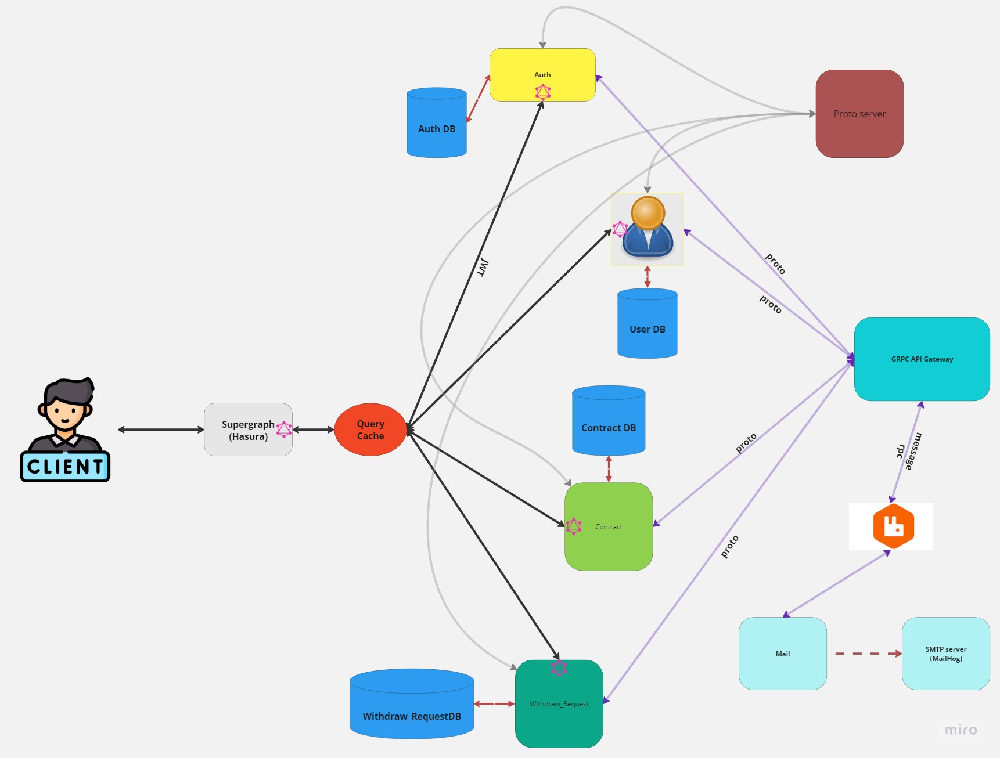
</details>
<details>
	<summary><h3>2.Database Design</h3></summary>


</details>
<details>
	<summary><h3>3.Query and Mutation Base On API Schema Design</h3></summary>
<details>
	<summary><h5>3-1.Arrange Collection Date</h5></summary>

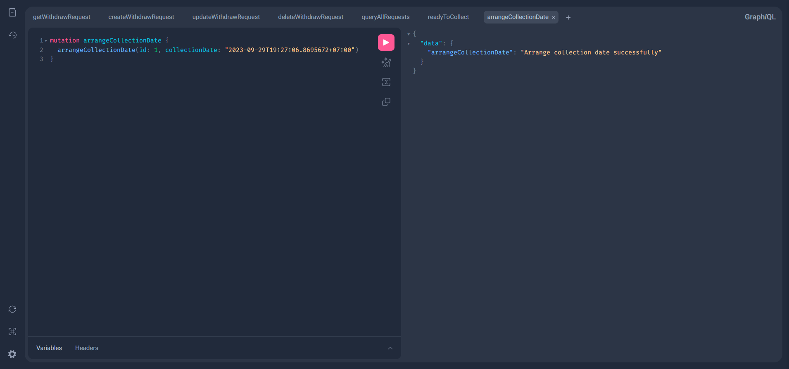
</details>
<details>
	<summary><h5>3-2.Exchange Token</h5></summary>

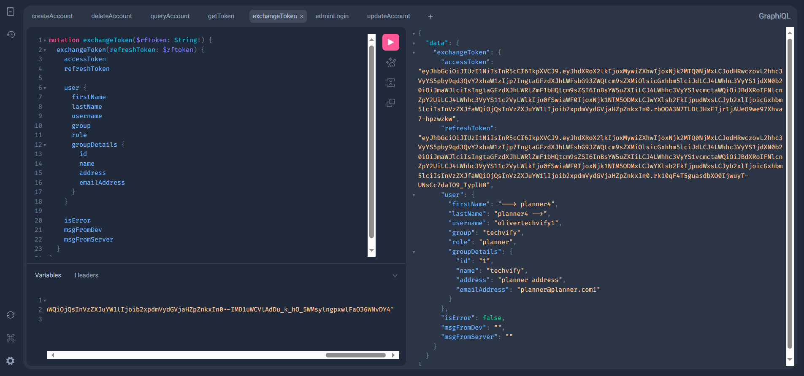
</details>
<details>
	<summary><h5>3-3.Change status to collected</h5></summary>

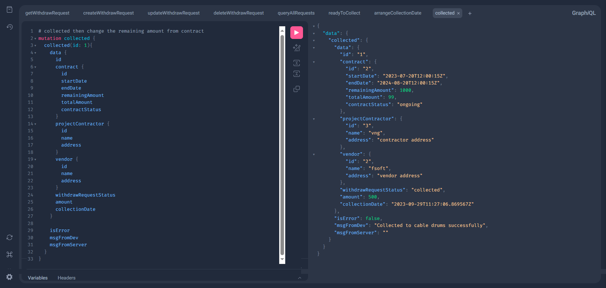
</details>
<details>
	<summary><h5>3-4.Create withdraw Request</h5></summary>

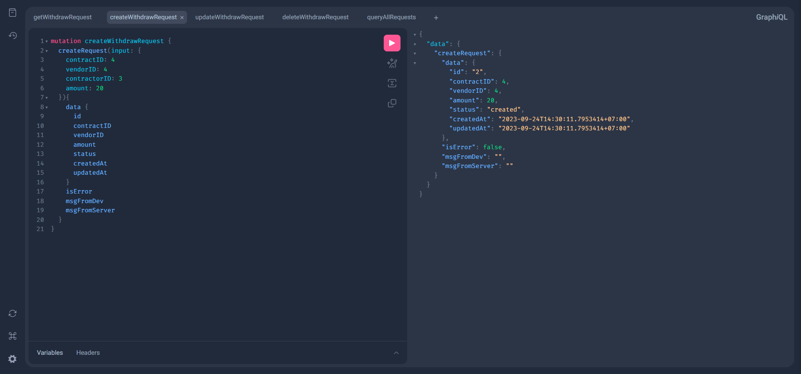
</details>
<details>
	<summary><h5>3-5.Get All Contracts</h5></summary>

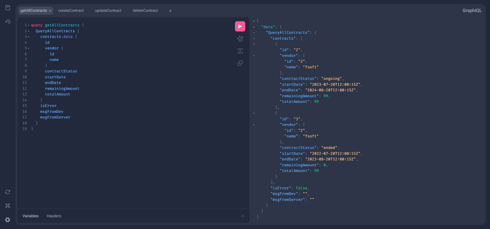
</details><details>
	<summary><h5>3-6.Get Contractor By ID</h5></summary>

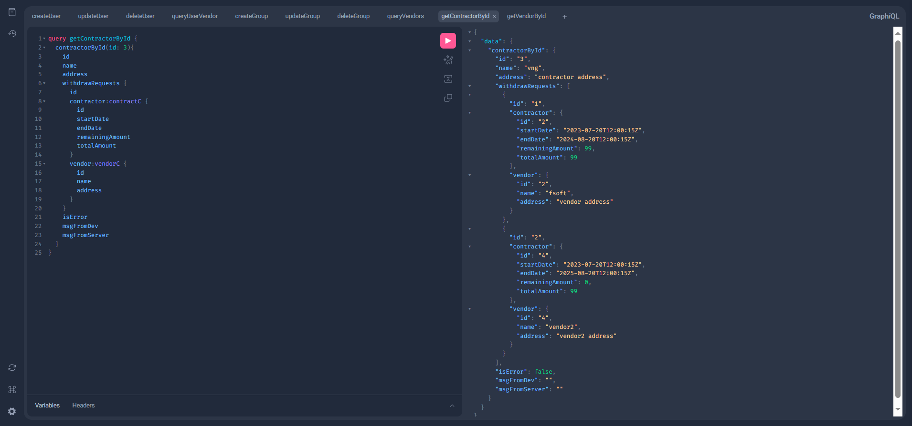
</details>
<details>
	<summary><h5>3-7.Get Vendor By ID</h5></summary>

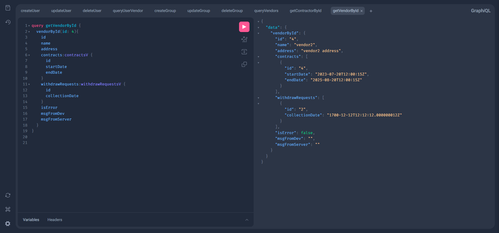
</details><details>
	<summary><h5>3-8.Get Token(Login)</h5></summary>

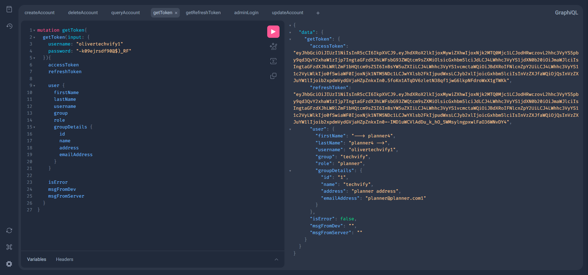
</details><details>
	<summary><h5>3-9.Logout</h5></summary>

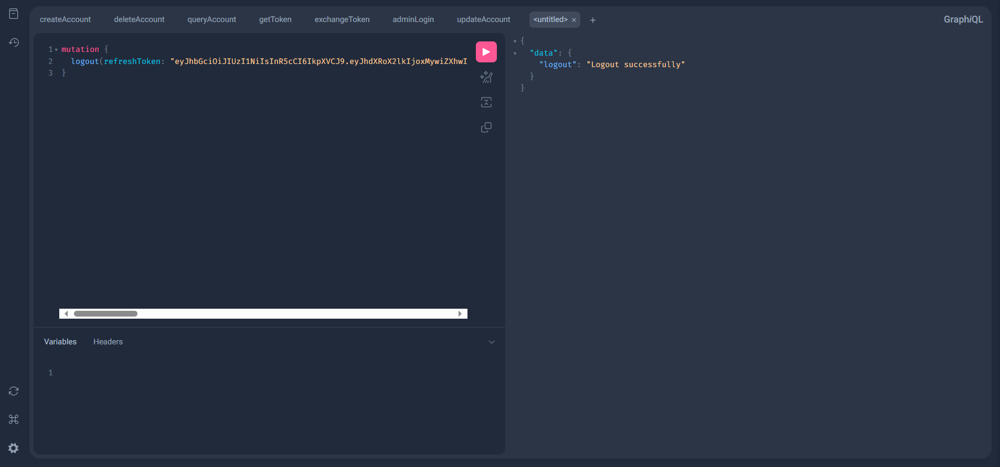
</details><details>
	<summary><h5>3-10.Get Contractors</h5></summary>

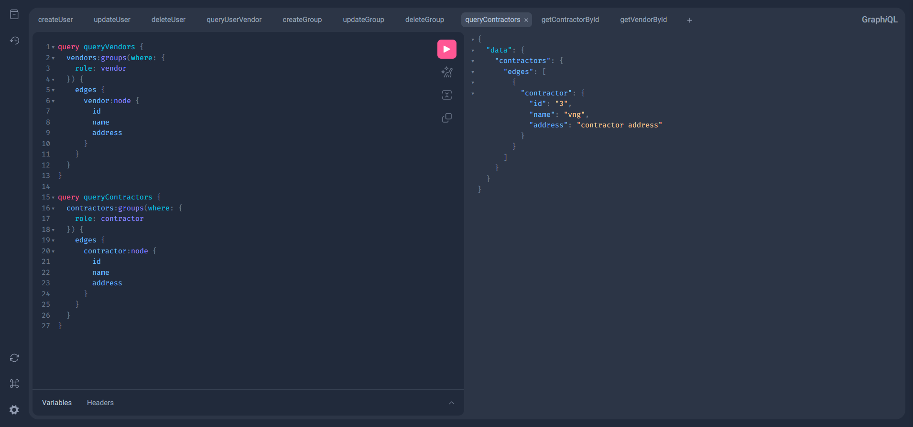
</details><details>
	<summary><h5>3-11.Get Vendor</h5></summary>

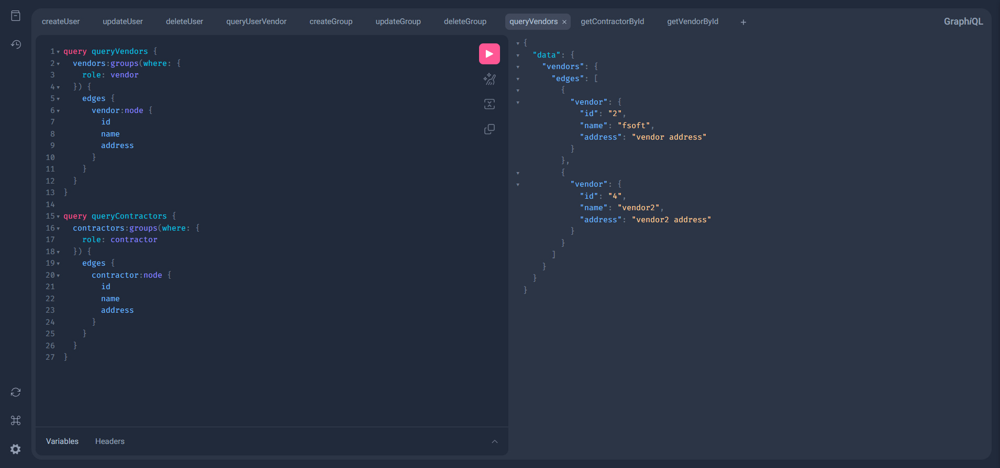
</details><details>
	<summary><h5>3-12.Get Withdraw Request</h5></summary>

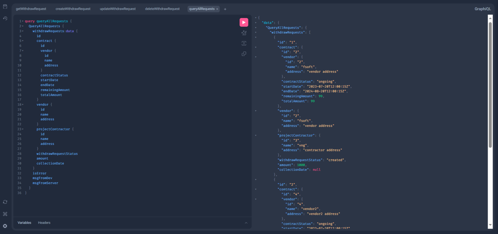
</details><details>
	<summary><h5>3-13.Change status to readyToCollect</h5></summary>

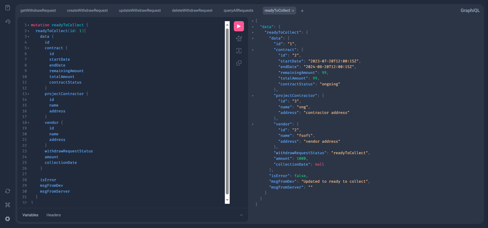
</details>


</details>


# III. How to Run This Project

**NOTE**: This guide assumes that you already have AtlasGo, Golang, and Protobuf installed. It may not be easy, but you will have a fun time with it. If some services have their ports running in the background and you don't know how to turn them off, run "net stop hns && net start hns."

<details>
	<summary><h3>1. How to Start the Project?</h3></summary>
1.1: Go to each service folder and run the following commands:
- `make up` (for docker-compose)
- `make migratedb` (for the database)

1.2: Configure the .env file in **_each service_**. You can use mine as a reference. The .yaml files also use .env as environment variables, so you don't need to configure the .yaml file.
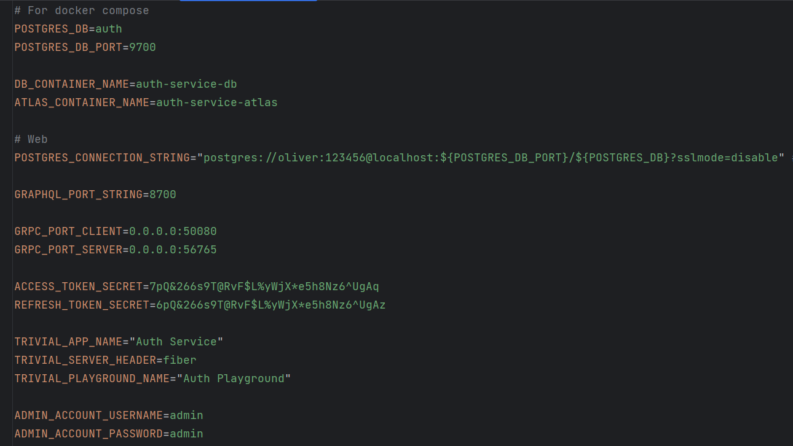

1.3: You need to create 6 command terminals and run 6 Makefile commands. It was configured to work perfectly on Windows, so it's best not to make changes.

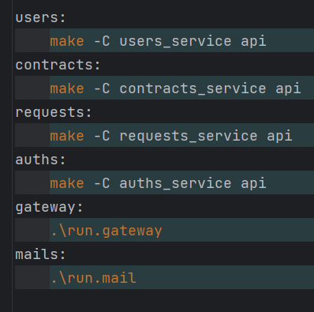

1.4: The link to each service will appear in the terminals. Click on it to open the GraphQL playground. The Email service interface will run on port 8025.

</details>
<!--  -->
<details>
	<summary><h3>2. How to Add These Services to Hasura API Gateway?</h3></summary>
2.1: Create a project and go to the Hasura Cloud environment.

2.2: Enable HASURA_GRAPHQL_ENABLE_REMOTE_SCHEMA_PERMISSIONS.

2.3: Enable and fill in HASURA_GRAPHQL_JWT_SECRET as follows:

```json
{
"key": "the secret key here must match the secret key in the project",
"type": "HS256"
}
```
<br>

2.4: Make your service available online on a website. Here, I will use ngrok. You will need at least 2 ngrok accounts (free) and divide your services the way you like in ngrok1.yml and ngrok2.yml.

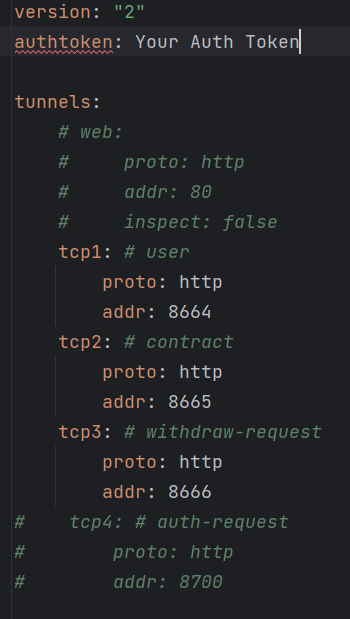

2.5: Add these services to the remote schema. Fill in all prefixes and suffixes of each service with different names. For example, if you add your users service, configure "GraphQL Customizations" like this:

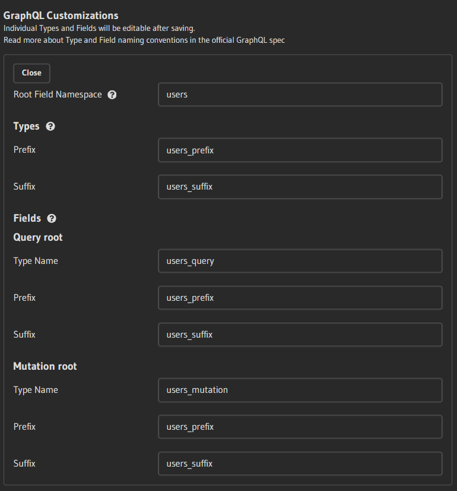
- You cannot use Apollo because Apollo doesn't have this feature, so you will need to modify your node interface names (node and nodes).

2.6: Configure the authorization and relationships, and modify your code to match the Hasura config (quite challenging).
- Note that if you use ngrok (or other free services) like me, each time you want to configure your authorization, you need to start from scratch because the URL will change, and Hasura breaks when the URL changes. Somehow, you cannot change the URL. This step takes about 1 to 1.5 hours to complete.

2.7: Test it!!!

</details>

<details>
	<summary><h3>3. How to update proto server and update all packages that used this server?</h3></summary>

3.1: Go to the proto server folder and run the following commands: make git 

- Enter message commit and version (version should be 1.x.x)

3.2: Go to main project folder and run the following commands: make proto 

- Enter the version(tag) you push in step 3.1.

3.3: Wait for a second, all packages that used proto server will be updated.
</details>